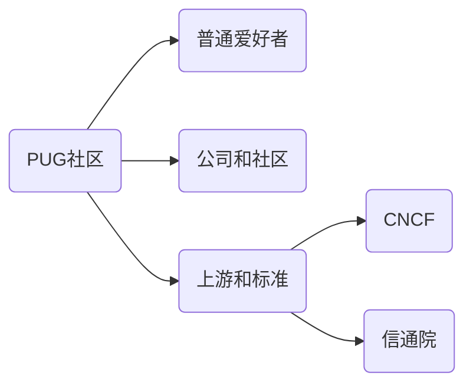
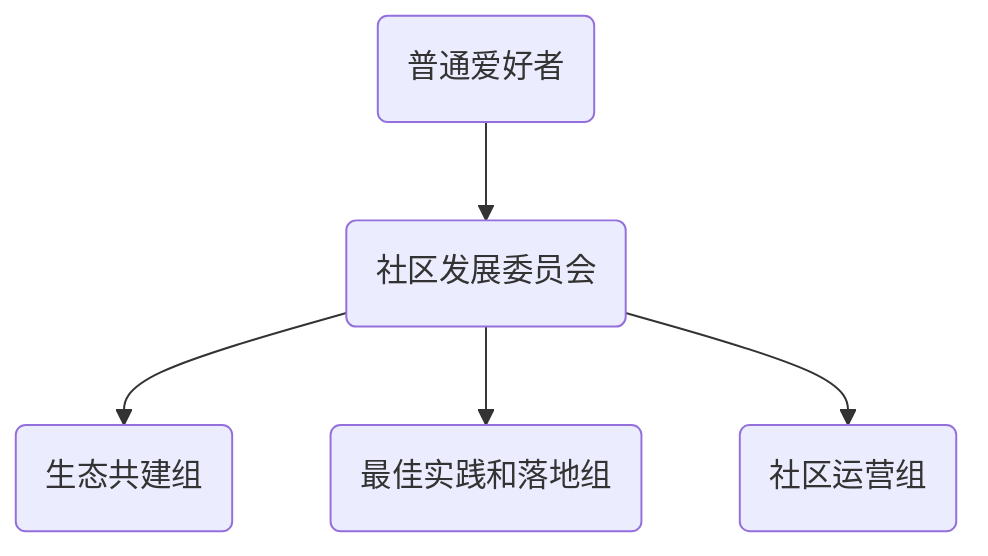
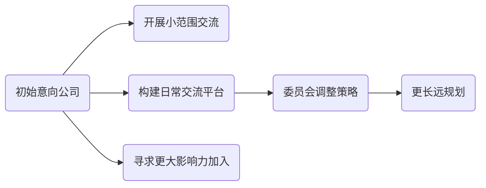

# 社区章程

平台工程作为Gartner发布的2023年十大战略技术趋势之一，目前正是共建国内平台工程社区的时机。社区的目标是推动平台工程在中国的发展，为相关从业人员提供交流的场所。

## 0. 关键原则

- 中立：中立和持久是平台类社区的基本要求
- 专业：只吸收优质的参与者和专业的内容
- 共享：平等、分享、链接

## 1. 社区的愿景

- 社区使命：推动平台平台概念的普及、共建平台工程的软件生态、推动平台工程在不同场景的落地是社区的最大公约数。
- 社区类型：协作型社区

## 2. 社区的成员

平台工程是一个新兴领域、作为个体很难形成产业影响力，因此平台工程社区需要团结一切可以团结的资源，通过大家共建的方式才有成功的可能。简单而言社区需要覆盖平台工程涉及的各个外延工作：和 CNCF 以及国际标准的对接、国内平台工程的标准、国内平台工程相关的公司、平台工程相关的开源项目社区、技术媒体、普通用户等。其中最核心的平台工程相关的公司、开源项目社区和技术媒体将是构建一个成功社区的关键部分。

最底层的制定标准、中间层协调负责标准的落地和生态共建、最上层是社区的主体参与者和传播者。

## 3. 社区的组织架构

社区组织有发展委员会作为最高的决策机构，分为生态共建、实践和落地、社区运行几个独立小组。

- 生态共建：主要是生态内相关开源项目的发起者或参与者
- 落地实践：主要是平台工程的实践等公司和组织
- 社区运营：组织技术交流、分享活动、文档翻译等

## 4. 会员会组成和内容

- 初始委员代表5-7个，由初创团队、个人组成
- 委员的义务和责任：
   - 参与文章的审核，每个文章2+人审核
   - Meetup场地资源和邀请工作
- 委员可以参与的事物：
   - 指派某人加入Github组织，维护网站
   - 指派某人加入微信公众号、参与运营

## 5. 社区初期发展思路

平台工程是一个涉及面比较大、门槛比较高的领域，必须要接轨国际一流社区、多个有影响力的成员加入，才能带来更多的资源和影响力。另外，可以利用早期参与者带来的资源先建立必要的渠道、小范围开展交流工作。通过边试水边灵活调整的策略寻找更好的路线。

简单而言，就是参考开源项目大路线尽早先试运行起来。聚集一定影响力的同时邀请更多的组织加入，再逐步规范化。在早期的阶段，生态共建组和落地实践组的参与者需要提供必要的资源，保障和促进早期交流活动的开展。

从更长远视角看，整个社区的发展和平台工程能否更好的落地息息相关，因此生态共建和落地实践是社区发展的原动力。这也注定了平台工程社区不能仅仅局限于标准和布道这些表面的工作，必须同时能够能促进相关平台和产品研发。大家都能有收获才是社区能够长久发展的保证。
